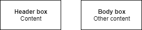

<div align="center">

# Termifier

A module to create interactive applications in the terminal

</div>

## Get started

To create an application with Termifier, you must start with a good management of the files and the project root. It is easy to organize these files because each class has its function and can be sorted by category

```
src/
   components/
      header.ts
      body.ts
   forms/
      main.ts
   app.ts
```

To start, we can define our first box. To do this, we will create the file `header.ts` in the folder `components`:

```typescript
// components/header.ts

import { TextBox } from '@termifier/core';

import { addColor } from '@termifier/logger';
import { centerContent, readFileAsync } from '@termifier/utilities';

export const Header = async (): Promise<TextBox> => {
	const textBox = new TextBox();

	textBox.addContent(centerContent(await readFileAsync(asciiBanner)));
	textBox.addContent(`\nPretty ${addColor('cool', 'yellow.bold')} uh?`);

	return textBox;
};
```

You can also create a second box, you can then recreate for example a `body.ts` file in the `components` folder:

```typescript
// components/body.ts

export const Body = async (): Promise<TextBox> => {
	const textBox = new TextBox();

	textBox.addContent(centerContent(`Hello world, from ${addColor('Termifier', 'orange')}!`));

	return textBox;
};
```

Do not forget to export the files with the `index.ts`. We have 2 boxes that can be distinguished separately like this

<div align="center">


Made with [diagrameditor](https://www.diagrameditor.com/)
<br><br></div>

Now we have to create a shape with our boxes. It will be displayed when the application launches. To do this, we will create the file `header.ts` in the folder `forms`:

```typescript
// forms/main.ts

import { Form, SpacerBox } from '@termifier/core';
import { Header, Body } from '../components';

export const MainForm = async (): Promise<Form> => {
	const form = new Form();

	form.addBox(await Header());
	form.addBox(new SpacerBox({ space: 3 }));
	form.addBox(await Body());

	return form;
};
```

We have a form that can be distinguished like this

<div align="center">


Made with [diagrameditor](https://www.diagrameditor.com/)
<br><br></div>

We have everything ready for our application to have style! The last step is to create the main file of the application, which will be executed. To do this, we will create the file `app.ts` in the folder `src`:

```typescript
// src/app.ts

import { App, clearTerminal } from '@termifier/core';
import { MainForm } from './forms';

const app = new App({ name: 'A simple exemple' });

(async () => {
	const mainForm = await MainForm();
	app.setForm(mainForm);

	app.run();
})();
```

We have now the application, that can be distinguished like this

<div align="center">


Made with [diagrameditor](https://www.diagrameditor.com/)
<br><br></div>

## Exemples design made with termifier

<div align="center"></div>